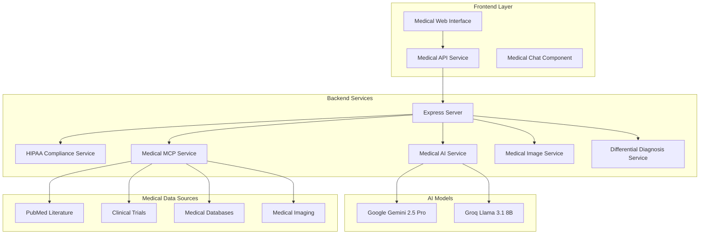

# MedIntel - Medical Research Platform

<div align="center">


[](https://www.hhs.gov/hipaa)
[](https://nodejs.org)
[](https://ai.google.dev)
[](https://modelcontextprotocol.io)

*Advanced Medical AI Platform with HIPAA Compliance, Multi-Modal Analysis, and Clinical Decision Support*

</div>

## 🏥 Overview

MedIntel is a sophisticated medical research platform that leverages cutting-edge AI technology to provide healthcare professionals with advanced clinical decision support tools. Built on the Model Context Protocol (MCP) foundation, it integrates multiple medical data sources and AI models to deliver comprehensive medical analysis capabilities.

### ✨ Key Features

- **🤖 Advanced Medical AI** - Google Gemini 2.5 Pro with medical-specific prompts
- **🔒 HIPAA Compliance** - Enterprise-grade security with AES-256 encryption
- **📊 Multi-Modal Analysis** - Text, medical images, and clinical data processing
- **🔍 Differential Diagnosis** - AI-powered clinical reasoning frameworks
- **🏥 Medical Data Integration** - PubMed, Clinical Trials, and Medical Databases
- **📷 Medical Image Analysis** - DICOM support with AI diagnostic assistance
- **💊 Drug Interaction Checking** - Comprehensive medication safety analysis
- **📋 Clinical Decision Support** - Evidence-based medical recommendations

## 🏗️ Architecture



## 🚀 Quick Start

### Prerequisites

- **Node.js** 18+ and npm
- **Google AI API Key** for Gemini 2.5 Pro
- **Groq API Key** for fallback AI model
- **MCP Servers** for medical data access

### Installation

1. **Clone the repository**
   ```bash
   git clone https://github.com/Klyne-Labs-LLC/medIntel-medical-research-platform.git
   cd medIntel-medical-research-platform
   ```

2. **Install dependencies**
   ```bash
   # Backend dependencies
   cd backend
   npm install
   
   # Frontend dependencies
   cd ../frontend
   npm install
   ```

3. **Environment Configuration**
   ```bash
   # Copy environment template
   cp backend/.env.example backend/.env
   
   # Edit with your API keys and configuration
   nano backend/.env
   ```

4. **Start the application**
   ```bash
   # Start backend server
   cd backend
   npm start
   
   # Start frontend (in another terminal)
   cd frontend
   npm run dev
   ```

5. **Access the platform**
   - Open your browser to `http://127.0.0.1:5000`
   - Create a secure medical session
   - Begin medical research and analysis

## ⚙️ Configuration

### Environment Variables

Create a `.env` file in the `backend` directory:

```env
# AI Configuration
GOOGLE_AI_API_KEY=your_gemini_api_key_here
GROQ_API_KEY=your_groq_api_key_here

# MCP Configuration
ALGOLIA_MCP_PATH=/path/to/algolia-mcp
PUBMED_MCP_PATH=/path/to/pubmed-mcp
CLINICAL_TRIALS_MCP_PATH=/path/to/clinical-trials-mcp
MEDICAL_DB_MCP_PATH=/path/to/medical-db-mcp
IMAGING_MCP_PATH=/path/to/imaging-mcp

# Security Configuration
ENCRYPTION_KEY=your_256_bit_encryption_key
JWT_SECRET=your_jwt_secret_key
HIPAA_AUDIT_ENABLED=true

# Server Configuration
PORT=3000
HOST=127.0.0.1
NODE_ENV=production

# Medical Image Configuration
MAX_IMAGE_SIZE_MB=50
SUPPORTED_IMAGE_FORMATS=jpg,jpeg,png,dicom,tiff

# Rate Limiting
API_RATE_LIMIT_WINDOW_MS=900000
API_RATE_LIMIT_MAX_REQUESTS=100
```

### MCP Server Setup

MedIntel requires several MCP servers for medical data access:

1. **PubMed MCP Server** - Medical literature search
2. **Clinical Trials MCP Server** - Clinical trials database
3. **Medical Database MCP Server** - Medical reference data
4. **Imaging MCP Server** - Medical image analysis

## 🏥 Medical Features

### Differential Diagnosis Engine

```javascript
// Example: Request differential diagnosis
const clinicalData = {
  symptoms: { present: ["chest pain", "shortness of breath"] },
  demographics: { age: 65, gender: "male" },
  history: { medications: ["lisinopril"], pastMedical: ["hypertension"] }
};

const diagnosis = await medicalAPI.getDifferentialDiagnosis(clinicalData);
```

### Medical Image Analysis

```javascript
// Example: Analyze medical image
const imageFile = document.getElementById('medicalImage').files[0];
const analysis = await medicalAPI.analyzeMedicalImage(
  imageFile, 
  "Chest X-ray for pneumonia evaluation",
  { analysisType: "diagnostic", urgency: "routine" }
);
```

### Drug Interaction Checking

```javascript
// Example: Check drug interactions
const medications = ["warfarin", "aspirin", "metoprolol"];
const newDrug = "ibuprofen";
const interactions = await medicalAPI.checkDrugInteractions(medications, newDrug);
```

## 🔒 Security & Compliance

### HIPAA Compliance Features

- **🔐 Data Encryption** - AES-256 encryption for all PHI
- **📝 Audit Logging** - Comprehensive medical interaction tracking
- **🛡️ PHI Detection** - Automatic detection and protection of sensitive data
- **⏰ Session Management** - Secure JWT-based medical sessions
- **🚫 Access Controls** - Role-based access to medical features

### Security Best Practices

- All medical data is encrypted at rest and in transit
- PHI is automatically detected and protected
- Comprehensive audit trails for all medical interactions
- Rate limiting to prevent abuse
- Secure session management with automatic expiration

## 🧪 Development

### Project Structure

```
medintel-platform/
├── backend/
│   ├── config/              # Medical prompts and configurations
│   ├── controllers/         # API route controllers
│   ├── middleware/          # HIPAA compliance middleware
│   ├── services/            # Core medical services
│   ├── utils/               # Utilities and helpers
│   └── server.js            # Express server entry point
├── frontend/
│   ├── css/                 # Medical theme and styling
│   ├── js/                  # Medical UI components
│   └── index.html           # Main application interface
├── .gitignore               # Git ignore rules
├── CLAUDE.md                # Claude Code integration guide
└── README.md                # This file
```

### Key Services

- **Medical AI Service** - Gemini integration and medical analysis
- **HIPAA Compliance Service** - Security and encryption
- **Medical MCP Service** - Multi-source medical data integration
- **Medical Image Service** - DICOM processing and AI analysis
- **Differential Diagnosis Service** - Clinical reasoning engine

### Development Commands

```bash
# Backend development
cd backend
npm run dev          # Start with nodemon
npm run test         # Run medical service tests
npm run audit        # Security audit

# Frontend development
cd frontend
npm run dev          # Start live server
npm run build        # Production build
```

## 📚 API Documentation

### Medical Chat Endpoint

```http
POST /api/medical-chat
Authorization: Bearer <session-token>
Content-Type: multipart/form-data

{
  "message": "Analyze chest pain symptoms",
  "patientContext": { "age": 45, "gender": "female" },
  "medicalImage": <file>
}
```

### Available Endpoints

- `POST /api/session` - Create secure medical session
- `POST /api/medical-chat` - Medical conversation with AI
- `POST /api/medical/differential-diagnosis` - Differential diagnosis
- `POST /api/medical/clinical-trials` - Search clinical trials
- `POST /api/medical/drug-interactions` - Check drug interactions
- `POST /api/medical/image-analysis` - Analyze medical images
- `GET /api/medical/health` - System health check
- `GET /api/medical/tools` - Available medical tools

## 🤝 Contributing

We welcome contributions to MedIntel! Please read our contribution guidelines:

1. **Fork the repository**
2. **Create a feature branch** (`git checkout -b feature/medical-enhancement`)
3. **Commit your changes** (`git commit -m 'Add new medical feature'`)
4. **Push to the branch** (`git push origin feature/medical-enhancement`)
5. **Open a Pull Request**

### Development Guidelines

- Follow HIPAA compliance requirements
- Add comprehensive tests for medical features
- Update documentation for new medical capabilities
- Ensure security best practices are maintained

## 📄 License

This project is licensed under the MIT License - see the [LICENSE](LICENSE) file for details.

## ⚠️ Medical Disclaimer

**IMPORTANT**: MedIntel is designed for educational purposes and clinical decision support only. It is not intended to replace professional medical advice, diagnosis, or treatment. Always consult with qualified healthcare professionals for medical decisions.

## 🆘 Support

- **Documentation**: [CLAUDE.md](CLAUDE.md)
- **Issues**: Create an issue for bug reports or feature requests
- **Email**: anian@klynelabs.com
- **Medical Support**: Consult with qualified healthcare professionals

## 🙏 Acknowledgments

- **Google AI** for Gemini 2.5 Pro medical analysis capabilities
- **Groq** for fast AI inference and fallback support
- **MCP Community** for the Model Context Protocol framework
- **Healthcare Professionals** for medical domain expertise and feedback

---

<div align="center">
  <strong>Built with ❤️ for Healthcare Professionals</strong>
  <br>
  <em>Advancing Medical Research Through AI Technology</em>
</div>
